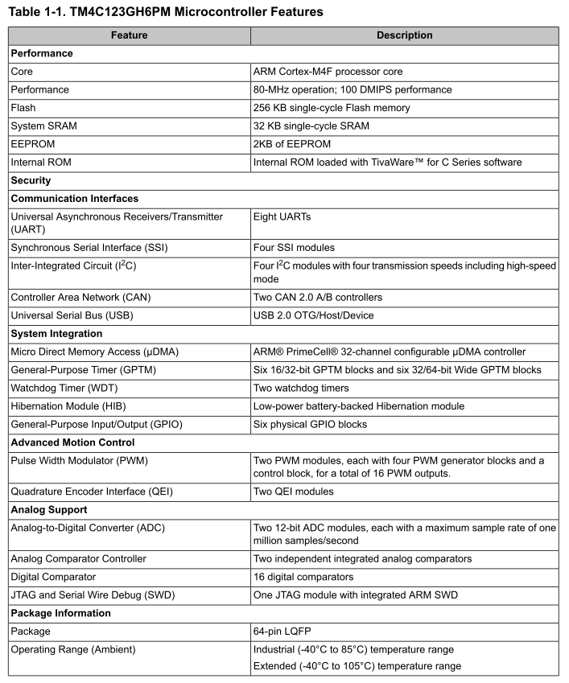
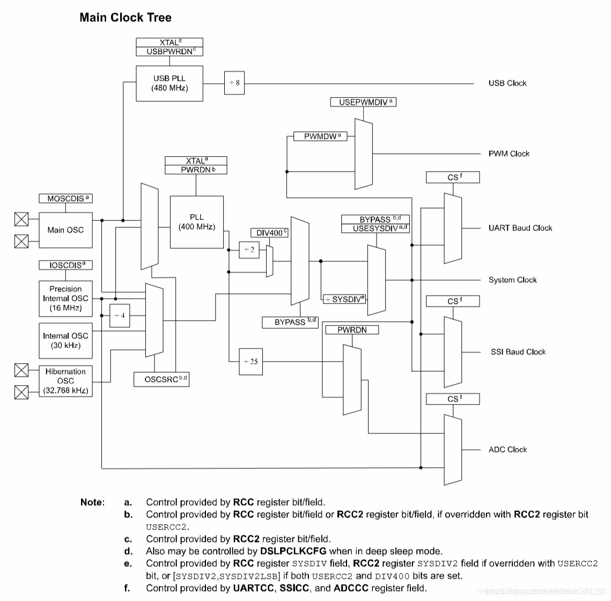
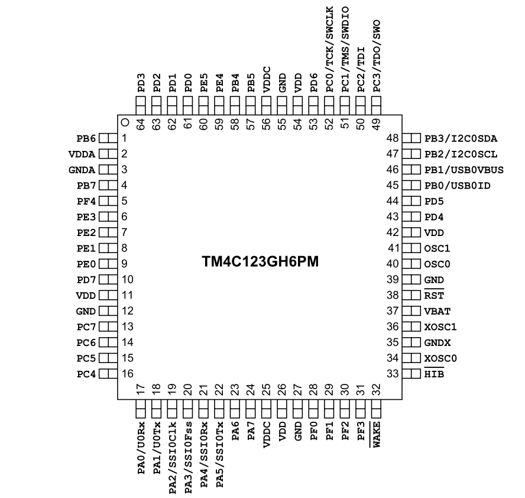
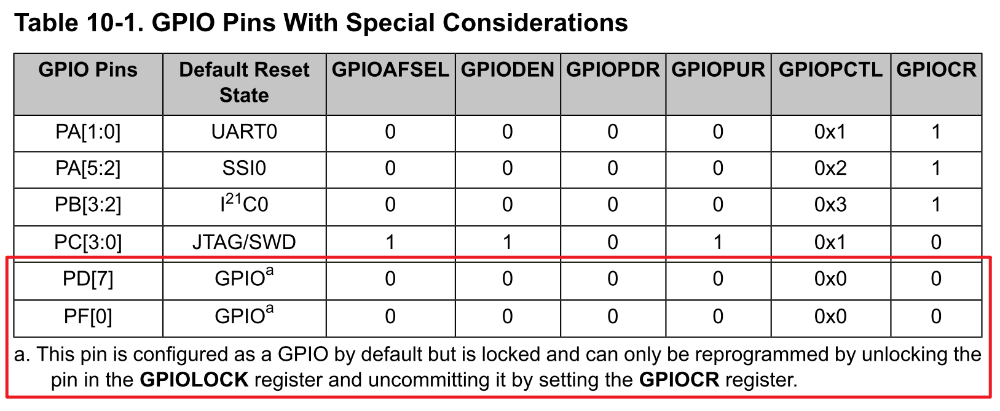
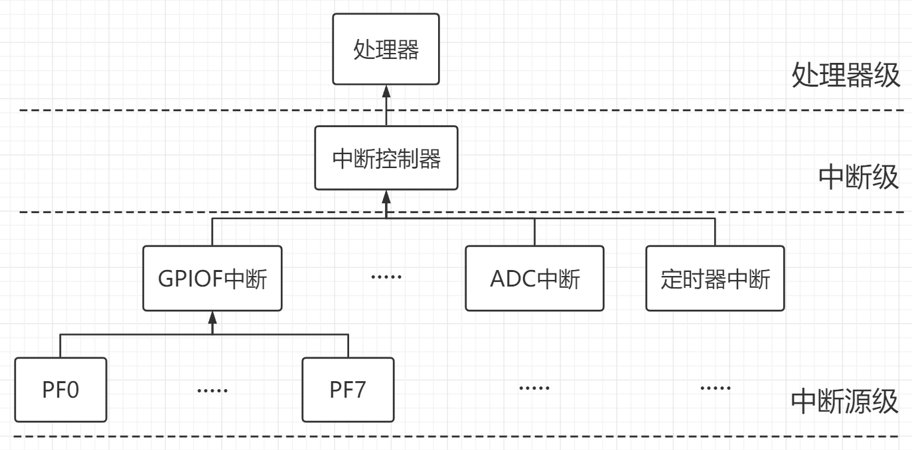
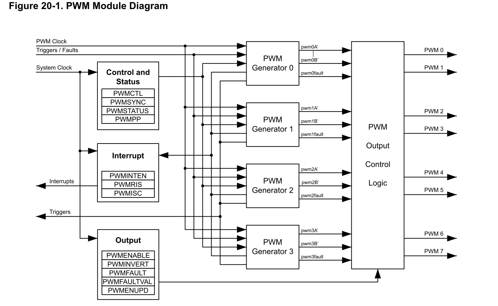
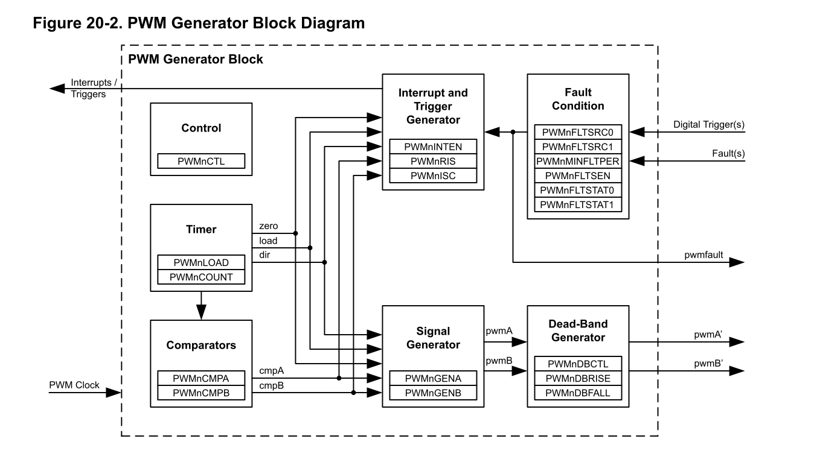
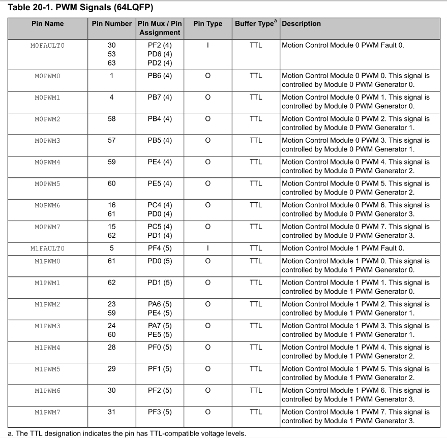
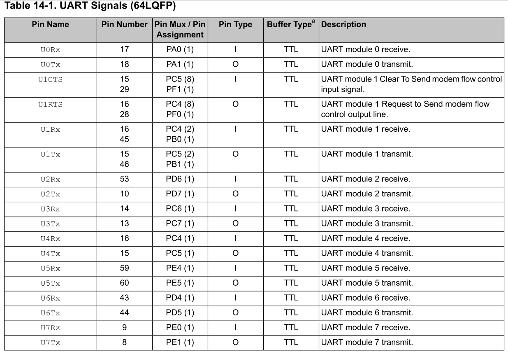
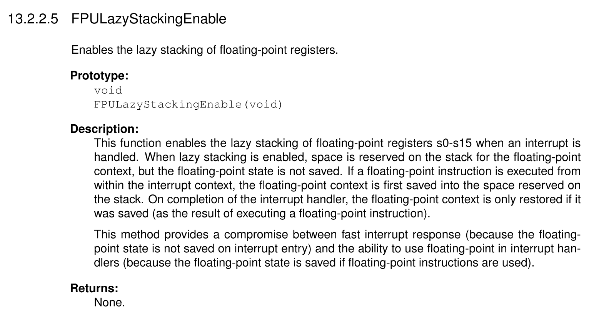

# TM4C123GH6PM

​																																							**Author SongJ**

## 芯片特性

- **32位 ARM Cortex™-M4处理器内核，主频 80MHz**
- **256 KB flash,、32 KB SRAM、2KB EEPROM**
- 内置 System Timer (SysTick)
- 集成嵌套中断控制器(NVIC)
- 内存保护单元Memory Protection Unit (MPU)
- **浮点运算单元(FPU)**
- 内部的ROM带有TivaWare™函数库（可以节省flash空间，函数可以直接调用）

## 控制器

- 8个PWM发生器（16路输出），每个均带有16位的计数器，2路PWM比较器，1个PWM信号发生器，1个死区控制，1个中断源选择
- 2个正交编码器接口(QEI)
- 6个32位的通用定时器(可用作12个16位)
- 6个64位的通用定时器(可用作12个32位）
- 12个16/32位 和 12个32/64位捕获比较PWM (CCP) 引脚
- 2个12位的ADC转换模块，扩展为12通道输入，采样率 1MHz
- 2个模拟比较器
- 16路数字比较器
- 片上带有稳压器

## 通信接口

- 8个USART，支持IrDA、9-bit、 ISO 7816 support (其中1个带全功能）
- 4个同步串行接口(SSI) ，可理解为SPI
- 4个IIC接口，支持100 Kbps和400 Kbps，可做主机或从机
- 2个CAN模块, using CAN protocol version 2.0 part A/B and with bit rates up to 1 Mbps
- USB控制器，支持USB 2.0全速(12 Mbps)，低速 (1.5 Mbps), 32 endpoints, 可用作USB OTG/Host/Device



## 一、时钟

| 时钟源                    | 简介                                                         |
| ------------------------- | ------------------------------------------------------------ |
| 内部高精度振荡器（PIOSC） | 内部振荡器，其频率为16MHz，精度为1%，可以用来驱动PLL         |
| 主振荡器 (MOSC)           | 外部高速振荡器，频率可在4-25M间选择，可以驱动PLL（此时频率在5-25M） |
| 低频内部振荡器 (LFIOSC)   | 适用于深度睡眠省电模式，它的频率是会改变的，范围在10KHz-90KHz之间，标准值30KHz |
| 休眠模块时钟源            | 32.768KHz晶振，用于实时时钟源或睡眠时钟                      |

### 1.时钟树



**注意：**

- MOSC与PIOSC可以驱动PLL
- PLL输出锁定在400MHz，它可以在经过二分频和SYSDIV分频（这个可以程序配置）后提供系统时钟。注意TM4C123G的**最大主频为80MHz**，因此配置时钟的时候，**若使用的PLL，最小分频数只能是2.5分频**。

### 2.时钟配置

使用函数 `void SysCtlClockSet(uint32_t ui32Config)` 进行系统时钟设置。

- 时钟分频SYSDIV设置

```C
#define SYSCTL_SYSDIV_1       0x07800000  // Processor clock is osc/pll /1
#define SYSCTL_SYSDIV_2       0x00C00000  // Processor clock is osc/pll /2
//...
#define SYSCTL_SYSDIV_62      0x9EC00000  // Processor clock is osc/pll /62
#define SYSCTL_SYSDIV_63      0x9F400000  // Processor clock is osc/pll /63
#define SYSCTL_SYSDIV_64      0x9FC00000  // Processor clock is osc/pll /64

#define SYSCTL_SYSDIV_2_5     0xC1000000  // Processor clock is pll / 2.5
#define SYSCTL_SYSDIV_3_5     0xC1800000  // Processor clock is pll / 3.5
#define SYSCTL_SYSDIV_4_5     0xC2000000  // Processor clock is pll / 4.5
//...
#define SYSCTL_SYSDIV_61_5    0xDE800000  // Processor clock is pll / 61.5
#define SYSCTL_SYSDIV_62_5    0xDF000000  // Processor clock is pll / 62.5
#define SYSCTL_SYSDIV_63_5    0xDF800000  // Processor clock is pll / 63.


```

- 系统时钟来源

```c
#define SYSCTL_USE_PLL          0x00000000  // System clock is the PLL clock
#define SYSCTL_USE_OSC          0x00003800  // System clock is the osc clock
```

- 时钟源选择

```C
#define SYSCTL_OSC_MAIN         0x00000000  // Osc source is main osc
#define SYSCTL_OSC_INT          0x00000010  // Osc source is int. osc
#define SYSCTL_OSC_INT4         0x00000020  // Osc source is int. osc /4
#define SYSCTL_OSC_INT30        0x00000030  // Osc source is int. 30 KHz
#define SYSCTL_OSC_EXT32        0x80000038  // Osc source is ext. 32 KHz
```

- 外接晶体频率

```C
#define SYSCTL_XTAL_1MHZ        0x00000000  // External crystal is 1MHz
#define SYSCTL_XTAL_1_84MHZ     0x00000040  // External crystal is 1.8432MHz
#define SYSCTL_XTAL_2MHZ        0x00000080  // External crystal is 2MHz
#define SYSCTL_XTAL_2_45MHZ     0x000000C0  // External crystal is 2.4576MHz
#define SYSCTL_XTAL_3_57MHZ     0x00000100  // External crystal is 3.579545MHz
//...
#define SYSCTL_XTAL_24MHZ       0x00000640  // External crystal is 24.0 MHz
#define SYSCTL_XTAL_25MHZ       0x00000680  // External crystal is 25.0 MHz
```

- 示例

```C
/* 时钟源使用MOSC，MOSC频率16M，系统时钟源自PLL锁相环倍频，SYSDIV5分频 */
/* 系统时钟频率400M/2/5=40M */
SysCtlClockSet(SYSCTL_OSC_MAIN|SYSCTL_XTAL_16MHZ|SYSCTL_USE_PLL|SYSCTL_SYSDIV_5);

/* 时钟源使用MOSC，MOSC频率16M，系统时钟源自PLL锁相环倍频，SYSDIV2.5分频 */
/* 系统时钟频率400M/2/2.5=80M , 注意这是上限了*/
SysCtlClockSet(SYSCTL_OSC_MAIN|SYSCTL_XTAL_16MHZ|SYSCTL_USE_PLL|SYSCTL_SYSDIV_2_5);

/* 时钟源使用MOSC，MOSC频率16M，系统时钟来自时钟源，SYSDIV不分频 */
/* 系统时钟频率16M/1=16M */
SysCtlClockSet(SYSCTL_OSC_MAIN|SYSCTL_XTAL_16MHZ|SYSCTL_USE_OSC|SYSCTL_SYSDIV_1);
```

- 获取时钟频率

```C
uint32_t SysCtlClockGet(void);
```

## 二、延时

### 1.库函数延时

TM4C库提供了一个延时函数，它利用汇编，提供了跨越工具链时恒定的延迟，延时3*ui32Count个时钟周期。

```C
__asm void SysCtlDelay(uint32_t ui32Count);
```

由于系统时钟不同，时钟周期也不同，改进的延时。

```C
/*假设系统时钟频率为nHz，即(n/1000)KHz，设cnt=(n/1000)，每秒有1000*cnt个周期，每个cnt长1ms。
SysCtlDelay(Count)可以延时3*Count个周期，令Count=cnt/3，即可延时1个cnt长（即1ms）*/
#define Dlay_ms(n) 	SysCtlDelay(n*(SysCtlClockGet()/3000))
#define Dlay_us(n)	SysCtlDelay(n*(SysCtlClockGet()/3))
```

注：以上函数仅在系统时钟频率≤40MHz的情况下稳定。

### 2.系统定时器(SysTick)延时

系统定时器延时的原理与状态机类似，就是通过系统定时器建立时钟线，程序运行以时钟线为基准，根据时钟变化即可实现延时。

> 官方文档：
>
> The timer consists of three registers:
> ■ SysTick Control and Status (STCTRL): A control and status counter to configure its clock,
> enable the counter, enable the SysTick interrupt, and determine counter status.
> ■ SysTick Reload Value (STRELOAD): The reload value for the counter, used to provide the
> counter's wrap value.
> ■ SysTick Current Value (STCURRENT): The current value of the counter.
>
> The SysTick counter runs on either the system clock or the precision internal oscillator (PIOSC)
> divided by 4.
>
>  The correct initialization sequence for the SysTick counter is:
> 1. Program the value in the STRELOAD register.
> 2. Clear the STCURRENT register by writing to it with any value.
> 3. Configure the STCTRL register for the required operation.

`Clear the STCURRENT register by writing to it with any value.`此步没有对应的库函数，配置时可以省略。时钟线的通过系统定时器中断建立，建议系统中断触发周期为1ms。

```C
#include "driverlib/systick.h"
#include "driverlib/interrupt.h"

#define TickPerSecond   (1000)						//每秒Tick数（中断次数）
#define usPerTick       (1000000 / TickPerSecond)	//每个Tick对应的微秒数

/**
 * 由于TickPerSecond = 1000，一秒恰被分为1000份，
 * 即1Tick周期为1ms，所以取系统时间单位为ms。
 */
static volatile uint32_t SysTime_ms;	//系统时间(ms)

//【1】系统定时器初始化
void SysTickInit(void)
{
  //设置重装值
  SysTickPeriodSet(SysCtlClockGet()/TickPerSecond);
  //注册中断
  SysTickIntRegister(SysTickIntHandler);
  //开启CPU中断处理器
  IntMasterEnable();
  //使能中断
  SysTickIntEnable();
  //开启系统定时器
  SysTickEnable();
}

//【2】系统定时器中断
void SysTickIntHandler(void)
{
    SysTime_ms++;
}

//【3】获取系统时间(ms)
uint32_t GetSysTime_ms(void)
{
  return SysTime_ms;
}

//【4】获取系统时间(us)
uint32_t GetSysTime_us(void)
{
  register uint32_t ms, us;
  
  do {
    ms = SysTime_ms;
    us = ((SysTickValueGet()/SysTickPeriodGet())*usPerTick) + ms*usPerTick;
  }while(ms != SysTime_ms);
  
  return us;
}

//【5】毫秒延时
void Delay_ms(uint32_t ms)
{
  uint32_t delayTime = GetSysTime_ms() + ms;
  while(GetSysTime_ms() < delayTime);
}

//【6】微秒延时
void Delay_us(uint32_t us)
{
  uint32_t delayTime = GetSysTime_us() + us;
  while(GetSysTime_us() < delayTime);
}
```

## 三、GPIO

- 支持43个可配置IO（Port A, Port B, Port C, Port D, Port E, Port F）
- 引脚可承受5V电压输入（除PB0、PB1、PD4、PD）

.png)

.png)

.png)

.png)



### 1.普通GPIO配置

使用GPIO执行输入、输出、采集等操作前需要配置GPIO为特定的使用模式。

> 官方文档：
>
> **Initialization and Configuration**
> The GPIO modules may be accessed via two different memory apertures. The legacy aperture, the
> Advanced Peripheral Bus (APB), is backwards-compatible with previous devices. The other aperture,
> the Advanced High-Performance Bus (AHB), offers the same register map but provides better
> back-to-back access performance than the APB bus. These apertures are mutually exclusive. The
> aperture enabled for a given GPIO port is controlled by the appropriate bit in the GPIOHBCTL
> register (see page 258). Note that GPIO can only be accessed through the AHB aperture.
> To configure the GPIO pins of a particular port, follow these steps:
>
> 1. Enable the clock to the port by setting the appropriate bits in the RCGCGPIO register (see
> page 340). In addition, the SCGCGPIO and DCGCGPIO registers can be programmed in the
> same manner to enable clocking in Sleep and Deep-Sleep modes.
> 2. Set the direction of the GPIO port pins by programming the GPIODIR register. A write of a 1
> indicates output and a write of a 0 indicates input.
>
> 3. Configure the GPIOAFSEL register to program each bit as a GPIO or alternate pin. If an alternate
> pin is chosen for a bit, then the PMCx field must be programmed in the GPIOPCTL register for
> the specific peripheral required. There are also two registers, GPIOADCCTL and GPIODMACTL,
> which can be used to program a GPIO pin as a ADC or μDMA trigger, respectively.
> 4. Set the drive strength for each of the pins through the GPIODR2R, GPIODR4R, and GPIODR8R
> registers.
> 5. Program each pad in the port to have either pull-up, pull-down, or open drain functionality through
> the GPIOPUR, GPIOPDR, GPIOODR register. Slew rate may also be programmed, if needed,
> through the GPIOSLR register.
> 6. To enable GPIO pins as digital I/Os, set the appropriate DEN bit in the GPIODEN register. To
> enable GPIO pins to their analog function (if available), set the GPIOAMSEL bit in the
> GPIOAMSEL register.
> 7. Program the GPIOIS, GPIOIBE, GPIOEV, and GPIOIM registers to configure the type, event,
> and mask of the interrupts for each port.
> Note: To prevent false interrupts, the following steps should be taken when re-configuring
> GPIO edge and interrupt sense registers:
> a. Mask the corresponding port by clearing the IME field in the GPIOIM register.
> b. Configure the IS field in the GPIOIS register and the IBE field in the GPIOIBE
> register.
> c. Clear the GPIORIS register.
> d. Unmask the port by setting the IME field in the GPIOIM register.
> 8. Optionally, software can lock the configurations of the NMI and JTAG/SWD pins on the GPIO
> port pins, by setting the LOCK bits in the GPIOLOCK register.

由官方文档可知GPIO的配置流程：

```C
/**
 * 1. 开启端口时钟
 * 2. 设置引脚方向
 * 3. 配置引脚复用
 * 4. 设置引脚驱动能力
 * 5. 设置推挽/上拉/下拉/开漏等功能
 * 6. 使能GPIO为数字IO/模拟
 * 7. 配置GPIO中断
 * 8. (可选)解锁/锁定NMI和JTAG/SWD引脚
 */

void Init_GPIO_As_Output(void)
{
    //【1】开启端口时钟
    SysCtlPeripheralEnable(SYSCTL_PERIPH_GPIOF);
    while(!SysCtlPeripheralReady(SYSCTL_PERIPH_GPIOF)); //等待时钟开启
    //【2】配置GPIO（包含步骤2、4、5、6）
    GPIOPinTypeGPIOOutput(GPIO_PORTF_BASE, GPIO_PIN_3);
}

void Init_GPIO_As_Input(void)
{
    //【1】开启端口时钟
    SysCtlPeripheralEnable(SYSCTL_PERIPH_GPIOF);
    while(!SysCtlPeripheralReady(SYSCTL_PERIPH_GPIOF)); //等待时钟开启
     //【2】配置GPIO（包含步骤2、4、5、6）
    GPIOPinTypeGPIOInput(GPIO_PORTF_BASE, GPIO_PIN_3);
}
```

### 2.普通IO操作

```C
//【1】GPIO输出高低电平
//*****************************************************************************
//! Writes a value to the specified pin(s).
//!
//! \param ui32Port is the base address of the GPIO port.
//! \param ui8Pins is the bit-packed representation of the pin(s).
//! \param ui8Val is the value to write to the pin(s).
//!
//! Writes the corresponding bit values to the output pin(s) specified by
//! \e ui8Pins.  Writing to a pin configured as an input pin has no effect.
//!
//! The pin(s) are specified using a bit-packed byte, where each bit that is
//! set identifies the pin to be accessed, and where bit 0 of the byte
//! represents GPIO port pin 0, bit 1 represents GPIO port pin 1, and so on.
//!
//! \return None.
//*****************************************************************************
void GPIOPinWrite(uint32_t ui32Port, uint8_t ui8Pins, uint8_t ui8Val)
{
    // Check the arguments.
    ASSERT(_GPIOBaseValid(ui32Port));

    // Write the pins.
    HWREG(ui32Port + (GPIO_O_DATA + (ui8Pins << 2))) = ui8Val;
}

//【2】读取GPIO电平
//*****************************************************************************
//! Reads the values present of the specified pin(s).
//!
//! \param ui32Port is the base address of the GPIO port.
//! \param ui8Pins is the bit-packed representation of the pin(s).
//!
//! The values at the specified pin(s) are read, as specified by \e ui8Pins.
//! Values are returned for both input and output pin(s), and the value
//! for pin(s) that are not specified by \e ui8Pins are set to 0.
//!
//! The pin(s) are specified using a bit-packed byte, where each bit that is
//! set identifies the pin to be accessed, and where bit 0 of the byte
//! represents GPIO port pin 0, bit 1 represents GPIO port pin 1, and so on.
//!
//! \return Returns a bit-packed byte providing the state of the specified
//! pin, where bit 0 of the byte represents GPIO port pin 0, bit 1 represents
//! GPIO port pin 1, and so on.  Any bit that is not specified by \e ui8Pins
//! is returned as a 0.  Bits 31:8 should be ignored.
//*****************************************************************************
int32_t GPIOPinRead(uint32_t ui32Port, uint8_t ui8Pins)
{
    // Check the arguments.
    ASSERT(_GPIOBaseValid(ui32Port));

    // Return the pin value(s).
    return(HWREG(ui32Port + (GPIO_O_DATA + (ui8Pins << 2))));
}

//【3】设置GPIO方向
//*****************************************************************************
//! Sets the direction and mode of the specified pin(s).
//!
//! \param ui32Port is the base address of the GPIO port
//! \param ui8Pins is the bit-packed representation of the pin(s).
//! \param ui32PinIO is the pin direction and/or mode.
//!
//! This function configures the specified pin(s) on the selected GPIO port
//! as either input or output under software control, or it configures the
//! pin to be under hardware control.
//!
//! The parameter \e ui32PinIO is an enumerated data type that can be one of
//! the following values:
//!
//! - \b GPIO_DIR_MODE_IN
//! - \b GPIO_DIR_MODE_OUT
//! - \b GPIO_DIR_MODE_HW
//!
//! where \b GPIO_DIR_MODE_IN specifies that the pin is programmed as a
//! software controlled input, \b GPIO_DIR_MODE_OUT specifies that the pin is
//! programmed as a software controlled output, and \b GPIO_DIR_MODE_HW
//! specifies that the pin is placed under hardware control.
//!
//! The pin(s) are specified using a bit-packed byte, where each bit that is
//! set identifies the pin to be accessed, and where bit 0 of the byte
//! represents GPIO port pin 0, bit 1 represents GPIO port pin 1, and so on.
//!
//! \note GPIOPadConfigSet() must also be used to configure the corresponding
//! pad(s) in order for them to propagate the signal to/from the GPIO.
//!
//! \note A subset of GPIO pins on Tiva devices, notably those used by the
//! JTAG/SWD interface and any pin capable of acting as an NMI input, are
//! locked against inadvertent reconfiguration.  These pins must be unlocked
//! using direct register writes to the relevant GPIO_O_LOCK and GPIO_O_CR
//! registers before this function can be called.  Please see the ``gpio_jtag''
//! example application for the mechanism required and consult your part
//! datasheet for information on affected pins.
//!
//! \return None.
//*****************************************************************************
void GPIODirModeSet(uint32_t ui32Port, uint8_t ui8Pins, uint32_t ui32PinIO)
{
    //
    // Check the arguments.
    //
    ASSERT(_GPIOBaseValid(ui32Port));
    ASSERT((ui32PinIO == GPIO_DIR_MODE_IN) ||
           (ui32PinIO == GPIO_DIR_MODE_OUT) ||
           (ui32PinIO == GPIO_DIR_MODE_HW));

    //
    // Set the pin direction and mode.
    //
    HWREG(ui32Port + GPIO_O_DIR) = ((ui32PinIO & 1) ?
                                    (HWREG(ui32Port + GPIO_O_DIR) | ui8Pins) :
                                    (HWREG(ui32Port + GPIO_O_DIR) & ~(ui8Pins)));
    HWREG(ui32Port + GPIO_O_AFSEL) = ((ui32PinIO & 2) ?
                                      (HWREG(ui32Port + GPIO_O_AFSEL) |
                                       ui8Pins) :
                                      (HWREG(ui32Port + GPIO_O_AFSEL) &
                                       ~(ui8Pins)));
}
```

### 3.特殊GPIO解锁



TM4C123GH6PM默认PD7与PF0为不可屏蔽中断，若要使用这两个引脚则需要解锁。

```C
/* Unlock PD7 */
HWREG(GPIO_PORTD_BASE + GPIO_O_LOCK) = GPIO_LOCK_KEY;
HWREG(GPIO_PORTD_BASE + GPIO_O_CR)  |= GPIO_PIN_7;
HWREG(GPIO_PORTD_BASE + GPIO_O_LOCK) = 0x00;

/* Unlock PF0 */
HWREG(GPIO_PORTF_BASE + GPIO_O_LOCK) = GPIO_LOCK_KEY;
HWREG(GPIO_PORTF_BASE + GPIO_O_CR) |= GPIO_PIN_0;
HWREG(GPIO_PORTF_BASE + GPIO_O_LOCK) = 0x00;
```

## 四、外部中断（EXTI）

TM4C123G的每个IO口都可以分别配置外部中断，**每组IO口对应一个中断服务函数**，每个IO口可以配置为边沿触发或状态触发。TM4C123G的中断优先级分为8级(【高】0 - 7【低】)。

TM4C123G的中断系统分为三级，即中断源级，中断控制器级，处理器级；使用外部中断需要同时打开三级中断。



```C
//【1】GPIO中断初始化
void Init_An_GPIO_Interrupt(void)
{
	//开启时钟
	SysCtlPeripheralEnable(SYSCTL_PERIPH_GPIOF);
	
	//设置PF4为输入，上拉（没按就是高电平，按下就是低电平）
	GPIODirModeSet(GPIO_PORTF_BASE, GPIO_PIN_4, GPIO_DIR_MODE_IN);	
	
	//方向为输入，推挽上拉
	GPIOPadConfigSet(GPIO_PORTF_BASE,
                     GPIO_PIN_4,
                     GPIO_STRENGTH_2MA,
                     GPIO_PIN_TYPE_STD_WPU);

	//配置中断为下降沿触发
	GPIOIntTypeSet(GPIO_PORTF_BASE, GPIO_PIN_4, GPIO_FALLING_EDGE);
	
	//为GPIOF注册中断函数
	GPIOIntRegister(GPIO_PORTF_BASE, GPIOF_Interrupt_Serve_Function);
	
	//开启三级中断
	GPIOIntEnable(GPIO_PORTF_BASE, GPIO_INT_PIN_4);
	IntEnable(INT_GPIOF);
	IntMasterEnable();
}

//【2】中断服务函数
void GPIOF_Interrupt_Serve_Function(void)
{	
	//获取中断状态
	uint32_t state = GPIOIntStatus(GPIO_PORTF_BASE, true);

	//清除发生的中断标志
 	GPIOIntClear(GPIO_PORTF_BASE, state);
    
  	if((state&GPIO_PIN_4) == GPIO_PIN_4)
  	{
        //to do
	}
}
```

## 五、Pulse Width Modulator (PWM)

TM4C123GH6PM支持8个PWM发生器（16路输出），每个均带有16位的计数器，2路PWM比较器，1个PWM信号发生器，1个死区控制，1个中断源选择。

TM4C123的PWM通过定时器实现，不同于STM32定时器的PWM模式，TM4C123的PWM发生器拥有自己的定时计数器。每个PWM信号发生器，可以配置两个PWM比较器，比较器根据设定的比较值和当前计数值输出高电平脉冲。







### 1.普通PWM配置

> 官方文档：
>
> **Initialization and Configuration**
> The following example shows how to initialize PWM Generator 0 with a 25-kHz frequency, a 25%
> duty cycle on the MnPWM0 pin, and a 75% duty cycle on the MnPWM1 pin. This example assumes
> the system clock is 20 MHz.
>
> 1. Enable the PWM clock by writing a value of 0x0010.0000 to the RCGC0 register in the System
>     Control module.
>
> 2. Enable the clock to the appropriate GPIO module via the RCGC2 register in the System Control
>     module.
>
> 3. In the GPIO module, enable the appropriate pins for their alternate function using the
>     GPIOAFSEL register.
>
> 4. Configure the PMCn fields in the GPIOPCTL register to assign the PWM signals to the appropriate
>     pins.
>
> 5. Configure the Run-Mode Clock Configuration (RCC) register in the System Control module
>     to use the PWM divide ( USEPWMDIV ) and set the divider ( PWMDIV ) to divide by 2 (000).
>
> 6. Configure the PWM generator for countdown mode with immediate updates to the parameters.
>     ■ Write the PWM0CTL register with a value of 0x0000.0000.
>     ■ Write the PWM0GENA register with a value of 0x0000.008C.
>     ■ Write the PWM0GENB register with a value of 0x0000.080C.
>
> 7. Set the period. For a 25-KHz frequency, the period = 1/25,000, or 40 microseconds. The PWM
>     clock source is 10 MHz; the system clock divided by 2. Thus there are 400 clock ticks per period.
>
>   Use this value to set the PWM0LOAD register. In Count-Down mode, set the LOAD field in the
>   PWM0LOAD register to the requested period minus one.
>        ■ Write the PWM0LOAD register with a value of 0x0000.018F.
>
> 8. Set the pulse width of the MnPWM0 pin for a 25% duty cycle.
>     ■ Write the PWM0CMPA register with a value of 0x0000.012B.
>
> 9. Set the pulse width of the MnPWM1 pin for a 75% duty cycle.
>     ■ Write the PWM0CMPB register with a value of 0x0000.0063.
>
> 10. Start the timers in PWM generator 0.
>     ■ Write the PWM0CTL register with a value of 0x0000.0001.
>
> 11. Enable PWM outputs.
>     ■ Write the PWMENABLE register with a value of 0x0000.0003.

```C
/* 生成1KHz，50%占空比的方波 */
void Init_A_PWM_Output(void)
{
    //【1】配置时钟，系统时钟8分频，即80M/8 = 10M
    SysCtlPWMClockSet(SYSCTL_PWMDIV_8);
    //【2】开启时钟，PWM & GPIO
    SysCtlPeripheralEnable(SYSCTL_PERIPH_PWM1);
	SysCtlPeripheralEnable(SYSCTL_PERIPH_GPIOF);
    //【3】配置引脚复用PWM功能
	GPIOPinTypePWM(GPIO_PORTF_BASE,GPIO_PIN_2);
	GPIOPinTypePWM(GPIO_PORTF_BASE,GPIO_PIN_3);
    //【4】配置引脚PWM通道
	GPIOPinConfigure(GPIO_PF2_M1PWM6);	//PF2->PWM模块1信号6
	GPIOPinConfigure(GPIO_PF3_M1PWM7);	//PF3->PWM模块1信号7
    //【5】配置PWM发生器
	//模块1->发生器3->向下计数，不同步
	PWMGenConfigure(PWM1_BASE,PWM_GEN_3,PWM_GEN_MODE_UP|PWM_GEN_MODE_NO_SYNC);	
	//【6】配置PWM周期
	PWMGenPeriodSet(PWM1_BASE,PWM_GEN_3,10000);	//10000/10000000 = 1/1000S = 1ms
	//【7】配置PWM占空比
	PWMPulseWidthSet(PWM1_BASE,PWM_OUT_6,PWMGenPeriodGet(PWM1_BASE, PWM_GEN_3)*0.5);	//M1PWM6 50%
	PWMPulseWidthSet(PWM1_BASE,PWM_OUT_7,PWMGenPeriodGet(PWM1_BASE, PWM_GEN_3)*0.5);	//M1PWM7 50%
	//【8】使能PWM模块1输出
	PWMOutputState(PWM1_BASE,PWM_OUT_6_BIT,true);
	PWMOutputState(PWM1_BASE,PWM_OUT_7_BIT,true);
	//【9】使能PWM发生器
	PWMGenEnable(PWM1_BASE,PWM_GEN_3);
}
```

### 2.SPWM

```C
void Init_A_PWM_Output(void)
{
    //【1】配置时钟，系统时钟8分频，即80M/8 = 10M
    SysCtlPWMClockSet(SYSCTL_PWMDIV_8);
    //【2】开启时钟，PWM & GPIO
    SysCtlPeripheralEnable(SYSCTL_PERIPH_PWM1);
	SysCtlPeripheralEnable(SYSCTL_PERIPH_GPIOF);
    //【3】配置引脚复用PWM功能
	GPIOPinTypePWM(GPIO_PORTF_BASE,GPIO_PIN_2);
	GPIOPinTypePWM(GPIO_PORTF_BASE,GPIO_PIN_3);
    //【4】配置引脚PWM通道
	GPIOPinConfigure(GPIO_PF2_M1PWM6);	//PF2->PWM模块1信号6
	GPIOPinConfigure(GPIO_PF3_M1PWM7);	//PF3->PWM模块1信号7
    //【5】配置PWM发生器
	//模块1->发生器3->向下计数，不同步
	PWMGenConfigure(PWM1_BASE,PWM_GEN_3,PWM_GEN_MODE_UP|PWM_GEN_MODE_NO_SYNC);	
	//【6】配置PWM周期
	PWMGenPeriodSet(PWM1_BASE,PWM_GEN_3,10000);	//10000/10000000 = 1/1000S = 1ms
	//【7】配置PWM占空比
	PWMPulseWidthSet(PWM1_BASE,PWM_OUT_6,PWMGenPeriodGet(PWM1_BASE, PWM_GEN_3)*0.5);
	PWMPulseWidthSet(PWM1_BASE,PWM_OUT_7,PWMGenPeriodGet(PWM1_BASE, PWM_GEN_3)*0.5);
	//【8】使能PWM模块1输出
	PWMOutputState(PWM1_BASE,PWM_OUT_6_BIT,true);
	PWMOutputState(PWM1_BASE,PWM_OUT_7_BIT,true);
	//【9】使能PWM发生器
	PWMGenEnable(PWM1_BASE,PWM_GEN_3);
}

void Set_M1PWM6_Duty(float duty)
{
    if(duty <= 1 && duty > 0)
    {
        PWMPulseWidthSet(PWM1_BASE, PWM_OUT_6,
                     	 PWMGenPeriodGet(PWM1_BASE, PWM_GEN_3)*duty);
        PWMOutputState(PWM1_BASE,PWM_OUT_6_BIT,true);
    }
    else if(duty == 0)
        PWMOutputState(PWM1_BASE,PWM_OUT_6_BIT,false);
}

void Set_M1PWM7_Duty(float duty)
{
    if(duty <= 1 && duty > 0)
    {
    	PWMPulseWidthSet(PWM1_BASE, PWM_OUT_7,
                     	 PWMGenPeriodGet(PWM1_BASE, PWM_GEN_3)*duty);
        PWMOutputState(PWM1_BASE,PWM_OUT_7_BIT,true);
    }
   	else if(duty == 0)
   		PWMOutputState(PWM1_BASE,PWM_OUT_7_BIT,false);
}
```

### 3.双路互补SPWM

双路互补PWM与单路PWM大部分一致，仅多了`PWMDeadBandEnable()`。

```C
void PWM_Init(void) {
  SysCtlPWMClockSet(SYSCTL_PWMDIV_8);
  SysCtlPeripheralEnable(SYSCTL_PERIPH_PWM0);
  SysCtlPeripheralEnable(SYSCTL_PERIPH_GPIOB);
  GPIOPinTypePWM(GPIO_PORTB_BASE, GPIO_PIN_6);
  GPIOPinTypePWM(GPIO_PORTB_BASE, GPIO_PIN_7);
  GPIOPinConfigure(GPIO_PB6_M0PWM0);
  GPIOPinConfigure(GPIO_PB7_M0PWM1);
  PWMGenConfigure(PWM0_BASE, PWM_GEN_0, PWM_GEN_MODE_DOWN | PWM_GEN_MODE_NO_SYNC);
  //周期 (10000/10×10^6)S = 1us
  PWMGenPeriodSet(PWM0_BASE, PWM_GEN_0, 10000);
  //占空比 50%
  PWMPulseWidthSet(PWM0_BASE, PWM_OUT_0, PWMGenPeriodGet(PWM0_BASE, PWM_GEN_0) / 2);
  PWMDeadBandEnable(PWM0_BASE, PWM_GEN_0, 100, 100); //死区 (100/10×10^6)S = 10us
  PWMOutputState(PWM0_BASE, PWM_OUT_1_BIT | PWM_OUT_0_BIT, true);
  PWMGenEnable(PWM0_BASE, PWM_GEN_0);
}
```


## 六、UART

TM4C123的串口是FIFO结构，并且FIFO长度可编程控制，



> 官方文档：
>
> **Initialization and Configuration**
> To enable and initialize the UART, the following steps are necessary:
>
> 1. Enable the UART module using the RCGCUART register (see page 344).
> 2. Enable the clock to the appropriate GPIO module via the RCGCGPIO register (see page 340).
> To find out which GPIO port to enable, refer to Table 23-5 on page 1351.
> 3. Set the GPIO AFSEL bits for the appropriate pins (see page 671). To determine which GPIOs to
> configure, see Table 23-4 on page 1344.
> 4. Configure the GPIO current level and/or slew rate as specified for the mode selected (see
> page 673 and page 681).

### 初始化串口&printf函数重定向。

TI官方提供有UART API文件`uartstdio.c/.h`，包含有UART初始化以及printf重定向。

使用`void UARTStdioConfig(uint32_t ui32PortNum, uint32_t ui32Baud, uint32_t ui32SrcClock)`函数初始化UART后，可以使用`void UARTprintf(const char *pcString, ...)`函数代替`printf`函数使用。

注：同一时间有且仅有一个串口能够使用`UARTprintf`，该函数默认重定向到UART0，可通过修改`uartstdio.c`文件中以下内容更换重定向串口。

> //*****************************************************************************
> //
> // The base address of the chosen UART.
> //
> //*****************************************************************************
> static uint32_t g_ui32Base = 0;// UART1 => 1，···

```C
void Init_UART0(void)
{
	//【1】开启时钟
    SysCtlPeripheralEnable(SYSCTL_PERIPH_GPIOA);
    SysCtlPeripheralEnable(SYSCTL_PERIPH_UART0);
    //【2】配置GPIO复用
    GPIOPinTypeUART(GPIO_PORTA_BASE, GPIO_PIN_0|GPIO_PIN_1);
    //【3】配置GPIO模式
    GPIOPinConfigure(GPIO_PA0_U0RX);
    GPIOPinConfigure(GPIO_PA1_U0TX);
    //【4】初始化+printf重定向
    UARTStdioConfig(0, 115200, SysCtlClockGet());
    /*
    关于UARTStdioConfig的说明：
    UARTStdioConfig函数是uartstdio.c/.h提供的API
    文件路径：TivaWare_C_Series-2.2.0.295\tivaware_c_series_2_1_4_178\utils
    CCS报错：
    undefined symbol         first referenced in file 
	----------------         ------------------------
	UARTStdioConfig          ./main.obj
	error #10234-D: unresolved symbols remain
	解决方法：将uartstdio.c/.h复制到工程目录下并包含。
    */
}


```

### UART中断

```C
void Init_UART0_And_Interrupt(void)
{
    //【1】开启时钟
    SysCtlPeripheralEnable(SYSCTL_PERIPH_GPIOA);
    SysCtlPeripheralEnable(SYSCTL_PERIPH_UART0);
    //【2】配置GPIO复用
    GPIOPinTypeUART(GPIO_PORTA_BASE, GPIO_PIN_0 | GPIO_PIN_1);
    //【3】配置GPIO模式
    GPIOPinConfigure(GPIO_PA0_U0RX);
    GPIOPinConfigure(GPIO_PA1_U0TX);
    //【4】初始化+printf重定向
    UARTStdioConfig(0, 115200, SysCtlClockGet());
   //【5】注册中断服务函数
    UARTIntRegister(UART0_BASE,UART0_IntHandler);
    //【6】设置中断优先级
    IntPrioritySet(INT_UART0, 0);
    //【7】三级中断使能
    IntMasterEnable();
    IntEnable(INT_UART0);
    UARTIntEnable(UART0_BASE, UART_INT_RX|UART_INT_RT); //使能接收中断和接收超时中断
}

void UART0_IntHandler(void)
{
    uint32_t ui_Status;
    int32_t i_UartReceiveData;

    ui_Status = UARTIntStatus(UART0_BASE, true); //读取当前的中断状态
    UARTIntClear(UART0_BASE, ui_Status); //清除中断状态

    while(UARTCharsAvail(UART0_BASE)) //如果接收FIFO有数据就不断接收
    {
        i_UartReceiveData = UARTCharGetNonBlocking(UART0_BASE); //接收数据
        UARTCharPutNonBlocking(UART0_BASE, i_UartReceiveData);	//将数据发送出去
    }
}
```


## 附

### ROM前缀

TM4C123的ROM中集成了一些外设驱动库代码（以下简称ROM函数）。使用ROM函数会直接跳转到ROM中去执行；使用一般函数，代码会在Flash中执行。也就是说**使用ROM函数可以节省内存空间，而ROM函数与普通函数在功能上没有区别**。

使用ROM函数前，需要包含头文件`#include "rom.h"`，并定义芯片型号`TARGET_IS_TM4C123_RB1`。

### HWREG函数

使用HWREG函数可以方便得对寄存器和RAM进行操作，典型应用就是位带操作。

### 位带操作

`hw_types.h`中已提供位带操作的宏，可以直接调用。

```C
//*****************************************************************************
//
// Macros for hardware access, both direct and via the bit-band region.
//
//*****************************************************************************
#define HWREG(x)                                                              \
        (*((volatile uint32_t *)(x)))
#define HWREGH(x)                                                             \
        (*((volatile uint16_t *)(x)))
#define HWREGB(x)                                                             \
        (*((volatile uint8_t *)(x)))
#define HWREGBITW(x, b)                                                       \
        HWREG(((uint32_t)(x) & 0xF0000000) | 0x02000000 |                     \
              (((uint32_t)(x) & 0x000FFFFF) << 5) | ((b) << 2))
#define HWREGBITH(x, b)                                                       \
        HWREGH(((uint32_t)(x) & 0xF0000000) | 0x02000000 |                    \
               (((uint32_t)(x) & 0x000FFFFF) << 5) | ((b) << 2))
#define HWREGBITB(x, b)                                                       \
        HWREGB(((uint32_t)(x) & 0xF0000000) | 0x02000000 |                    \
               (((uint32_t)(x) & 0x000FFFFF) << 5) | ((b) << 2))
```

### FPU

在CCS中开启FPU需要如下两步：

1. 工程--Properties--Build--ARM Compiler--Processor options--Specify floating point support--FPv4PD6
2. 在main函数起始添加`FPUEnable();` `FPULazyStackingEnable();`

注：

- CCS默认开启FPU。

- 若缺少第一步，即使代码里添加了第二步，FPU也不会开启，第二步建议加上。


LazyStacking是Cortex-M4引入的机制，使用LazyStacking可以提高中断响应速度。

